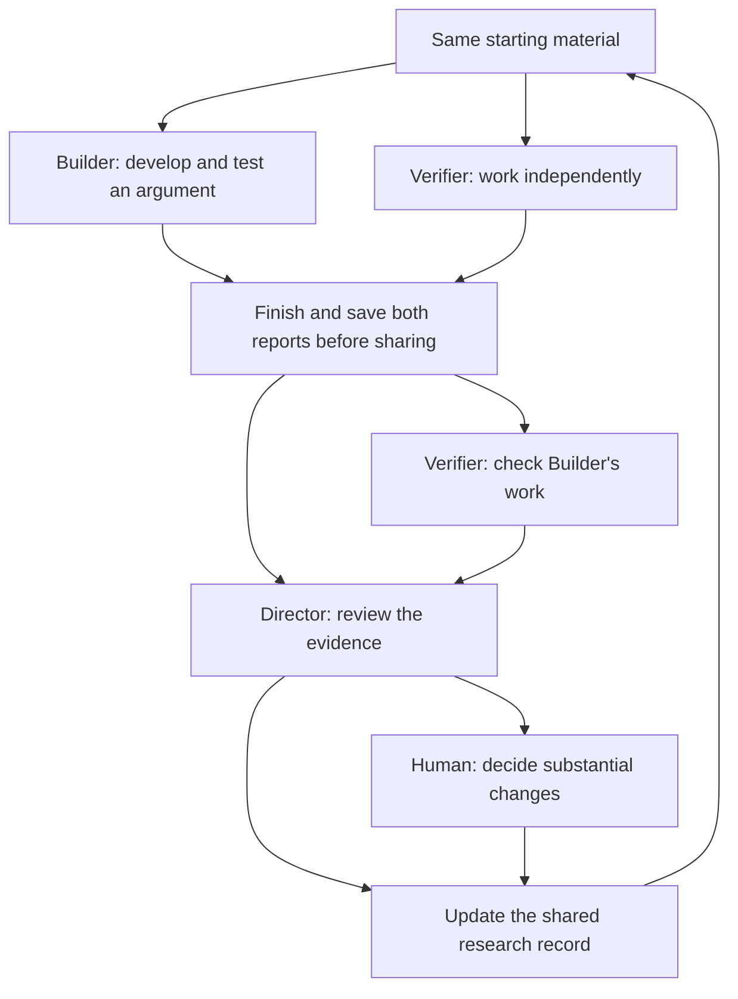

# Theory Lab architecture

Theory Lab gives three agents different jobs. Builder develops an argument.
Verifier works through the same problem independently, then checks Builder's work.
Director reviews the evidence and decides what belongs in the shared research
record. Agreement alone is not enough: a claim needs a clear statement, explicit
assumptions, and evidence that supports it.

This guide requires Builder and Verifier to finish and save both reports before
either report is shared. Later corrections belong in separate notes, so readers
can still see what each agent found independently.

## Information flow

A later round starts from a saved copy of the updated research record. Changes to
the research objective need a human decision.

## Responsibilities

| Component | Responsibility | Limits |
| --- | --- | --- |
| Builder | State claims precisely, develop arguments, test assumptions, and keep useful failed attempts. | Writes its own report and recommends changes to the shared record. |
| Verifier | Work independently, then check Builder's reasoning, assumptions, counterexamples, and use of sources. | Saves its independent report before reading Builder's work; cannot approve its own claim. |
| Director | Compare the claims, weigh the evidence, and record a decision. | Must follow the review requirements and refer substantial changes to the human. |
| Controller or operator | Save the starting material and reports, control access, check record structure, and track resource use. | These controls do not establish mathematical correctness. |
| Human | Set the objective, decide substantial changes, review progress, and choose when to stop or continue. | Agents may recommend these decisions but cannot make them for the human. |

## One round

1. **Prepare the starting material.** Save the objective, statements to examine,
   allowed sources, current research record, and resource limits. Give this copy
   a unique reference so everyone can identify what was supplied.
2. **Work independently.** Give Builder and Verifier the same starting material
   in separate contexts. Neither reads the other's work. Each explains its
   assumptions, supporting claims, evidence, and remaining gaps.
3. **Finish and save both reports before sharing.** Keep the saved copies
   unchanged and record their content hashes. A hash helps identify a file;
   access controls must keep the reports private until this step is complete.
4. **Check Builder's work.** Verifier reads Builder's saved report and writes a
   separate critical review. Find invalid steps or mismatched assumptions, check
   cited theorems, and test counterexamples against every stated assumption.
5. **Review the evidence.** Director reads both reports and the critical review.
   Check whether the agents considered the same statement, assess each objection,
   and explain the decision. One valid counterexample can defeat a claim even
   when several agents agree with it.
6. **Update the shared research record.** Check the records and references, then
   apply only changes that meet the review requirements. Refer substantial changes
   in objective, scope, or assumptions to the human. Keep earlier statements,
   refutations, and reports available.
7. **Review progress.** Record which claims held up, which failed, and what remains
   unresolved. Use a saved copy of the updated record for any later round. Report
   to the human after every three completed rounds, or sooner if a substantial
   decision blocks progress.

## Research records

The shared research record contains definitions, assumptions, and claims. Keep it
separate from reports, which retain each round's reasoning and decisions, and
from generated indexes, which help readers find records.

Give each claim a stable identifier and a version number. Record the exact
statement, definitions, assumptions, claims it relies on, evidence, status,
unresolved objections, and the decision behind its status. When using an outside
theorem, cite the source and explain how its assumptions match the present use.

Distinguish a written proof, a cited theorem, a finite computation, and a
conjecture. For a computation, record the domain, range, procedure, random seed
when relevant, and what the result shows. A finite check supports only what it
checked; a broader conclusion needs a separate argument.

Changing an assumption, quantifier, domain, or conclusion creates a new statement
version and requires another review. Keep a refuted statement unchanged. Give a
repaired statement a new identifier linked to the earlier one. If a supporting
claim changes, review the claims that depend on it.

## Claim states

| State | Meaning |
| --- | --- |
| `REAUDIT_PENDING` | A claim from another source is waiting for review. |
| `OPEN` | A question is clear, but a complete claim has not yet been stated. |
| `CONJECTURED` | The claim and everything it assumes or relies on are stated explicitly. |
| `COMPUTATIONALLY_SUPPORTED` | Reproducible finite checks support the claim within the checked range. |
| `PROVED_PENDING_AUDIT` | A complete written proof is available, but independent review is unfinished. |
| `ESTABLISHED` | The required independent checks are complete and Director has accepted the claim. |
| `REFUTED` | A valid counterexample or contradiction defeats the stated claim. |

Accepting a claim as `ESTABLISHED` requires a saved statement and content hash,
explicit definitions and assumptions, a complete written proof, an independent
review of that same statement, and accepted supporting claims. It also requires
applicable attempts to find counterexamples, careful checks of outside theorems,
resolution of any substantial decision affecting the claim, and Director's written
decision. No agent may approve its own result.

The [status policy](protocols/STATUS_POLICY.md) lists the allowed changes between
states. `ESTABLISHED` means the claim passed this review process. It does not mean
the proof was checked by a proof assistant or that the reviewers cannot be wrong.

## Deployment obligations

- Control what each role can read and edit. Different prompts or folders alone
  do not keep the agents' working contexts separate.
- Keep both saved reports unchanged, and record when they are shared. Put later
  corrections in separate notes.
- Give each role only its assignment, allowed sources, its own work, and reports
  shared at the proper stage. Keep credentials and operator-only material out.
- Set resource limits, track actual use, and stop at those limits. Keep the work
  completed so far and note what remains unresolved.
- Check records and references before applying changes. Preserve earlier versions
  and the reasons for decisions.
- Treat documents, citations, and tool outputs as material to examine. They cannot
  grant permissions or change a role's instructions.

These are rules for running the workflow. This repository provides instructions,
not software that enforces them; a working setup must implement and check the
controls described here.
