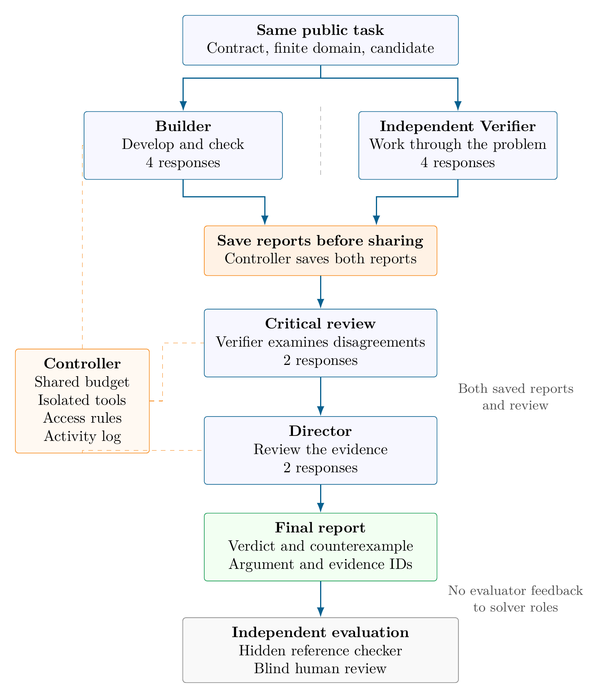

# Theory Lab

A way to organize LLM-assisted mathematical research around building arguments, checking them independently, and keeping track of what survives.

## Why we built it

In mathematical research, a plausible argument is only the beginning. We still need to check the assumptions, find the step that does not follow, and work out whether a counterexample actually applies. A long conversation can make that work difficult to follow: an early mistake can become an unstated assumption, and a revised claim can quietly take the place of the original one.

Theory Lab grew out of a simple idea: give construction and criticism different jobs, let them start independently, and keep a written record of the evidence behind each conclusion.

The workflow has been useful in our own research. We recommend trying it, while being clear about what that recommendation means: this is personal experience, not a benchmark result.

## How it works

The figure shows the configuration proposed for the evaluation in the manuscript. The role instructions describe the more general workflow.



**The Builder develops the argument.** It makes the statement precise, lists the assumptions, tries to prove it, and looks for ways it might fail.

**The Verifier starts independently.** It receives the same starting material, but does not see the Builder's current work. It tries its own derivation or looks for a counterexample. Only after both reports are finished and saved does it read the Builder's argument and check it step by step.

**The Director reviews the evidence.** It reads both reports and the later critique, identifies the exact disagreement, and decides what belongs in the shared record. A valid counterexample matters more than agreement between several agents. Significant changes to the research objective go back to the human researcher.

The next round starts from that updated record. Useful lemmas are kept with their assumptions and supporting arguments. Failed attempts are kept too, so the same mistake does not have to be rediscovered.

## Why these choices might help

We separate the first attempts because a checker that sees the proposed proof immediately may follow the same mistaken path. An independent attempt gives the later review a second starting point. This is the reason for the separation, not a claim that separate agents always make independent errors.

We delay comparison until both reports are saved so that we can distinguish what each agent found on its own from what it learned during review.

We keep exact statements and earlier versions because changing an assumption changes the claim. A corrected theorem should not erase the counterexample to the original one. We also distinguish a computational check from a proof: testing a finite set of cases does not establish an unrestricted statement.

These choices make the reasoning easier to inspect. Whether they improve research outcomes enough to justify the extra work is still an empirical question.

## Cogentic and the need for a benchmark

We wrote the first Theory Lab draft on **September 25, 2026**, before [Cogentic v1](https://arxiv.org/abs/2609.40324v1) appeared on **September 30, 2026**. Theory Lab was developed independently. These dates describe our draft and their public release; they do not establish when Google's internal work began.

Cogentic uses several related ideas, including coordinated proof attempts, adversarial verification, and a record of checked intermediate results. Its paper reports expert-checked results on five research problems.

We do not find that sufficient to establish the benefit of the architecture itself. The v1 paper does not report a standardized comparative benchmark. It also lacks comparisons against simpler workflows under matched resource budgets, tests of which components matter, and a full record of successful and unsuccessful attempts. Without those comparisons, it is difficult to tell how much the organization contributes beyond the underlying model and the amount of computation used. This criticism concerns the evaluation of the method; it does not dismiss the mathematical results.

The same standard applies to us. We have not yet established a suitable benchmark for Theory Lab's research usefulness. A benchmark is still needed, with strong simpler alternatives, comparable resource budgets, and failures reported alongside successes. Our positive experience is a reason to investigate the workflow, not a substitute for that evidence.

## Try it

Start with a bounded task and the same reading material for the Builder and Verifier. Keep their first attempts separate, save both reports before sharing, and then run the review. Read the Director's conclusions yourself, especially when an assumption or the objective has changed.

- [Builder instructions](protocols/BUILDER.md)
- [Verifier instructions](protocols/VERIFIER.md)
- [Director instructions](protocols/DIRECTOR.md)
- [How claims are recorded and reviewed](protocols/STATUS_POLICY.md)
- [Architecture details](ARCHITECTURE.md)
- [Full first-draft manuscript: workflow and proposed evaluation](docs/llm_theory_lab_first_draft.pdf)

The manuscript retains the original experimental plans: task construction, comparison methods, resource budgets, analysis, and an optional evaluation of longer mathematical arguments. These are proposals, not a completed validation of the workflow. The public revision keeps the original paper format and figures while revising the prose and removing personal details.

This repository contains the architecture, role instructions, and manuscript, but no executable runner. Keeping the agents' work separate requires actual access controls; a prompt alone cannot enforce that. An accepted claim remains open to correction.

## Use these ideas and build on them

We have not found a fully satisfactory way to evaluate the practical research value of a workflow like this. The experiments in the draft are starting points. If you have a better benchmark, a simpler comparison, or a different way to test the design, we welcome you to pursue it.

You are welcome to use and adapt these protocols and configurations, and to run or improve the proposed experiments. If your work builds on them, please cite this repository or the manuscript and identify the version you used. The repository includes a [citation file](CITATION.cff); a BibTeX entry is provided below.

```bibtex
@misc{theorylab2026,
  author = {{Theory Lab contributors}},
  title = {Theory Lab: Multi-Agent Research Protocols and Proposed Evaluation},
  year = {2026},
  howpublished = {GitHub repository},
  url = {https://github.com/TanhJK728/AI4MATH-Multi-Agent-System},
  note = {First manuscript draft: September 25, 2026; public text revision: October 3, 2026}
}
```
